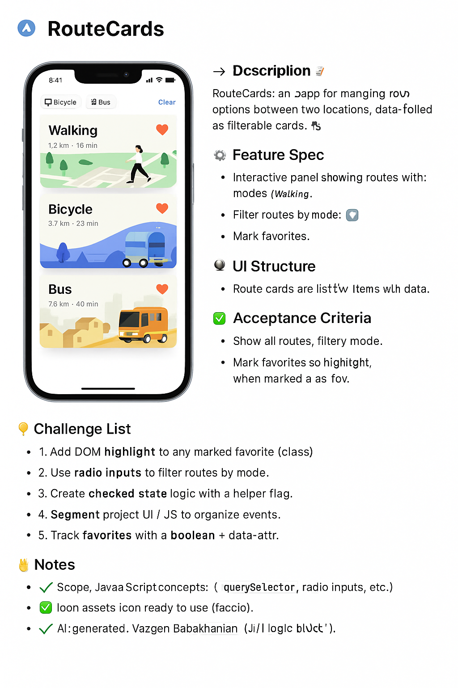

# 📍 Route Cards — A → B

**Author:** Vazgen Babakhanian  
**Attribution:** HTML + CSS layout generated by AI; all JavaScript logic coded by Vazgen Babakhanian.  

---

## 📝 Description  

**High-level overview**  
Route Cards is a clean, mobile-first, Apple-inspired web app that displays journeys from **Origin → Destination**.  
Users can filter by **transport mode** (Walk, Bike, Bus), toggle **“Illustrated only”**, favorite routes, and even pick a random route to explore.  

**Detailed flow**  
- The top filter panel uses radio inputs for mode and a checkbox for “Illustrated only.”  
- Below, dynamically rendered “route cards” show Origin, Destination, Mode badges, Vibes, and a Favorite button.  
- Users apply filters to show matching cards, toggle favorites, and persist everything via `localStorage`.  
- On reload, filter selections and favorites restore automatically.  
- The design mirrors iOS aesthetics — soft gray panels, SF Pro fonts, and rounded cards with subtle shadows.

---

## ⚙️ Feature Spec  

- **Filter Control:**  
  - “Apply filters” is disabled until a mode is chosen.  
  - Active mode label is visually highlighted.  

- **Filtering Behavior:**  
  - Only routes matching the selected mode are displayed.  
  - When “Illustrated only” is checked, filter further to `illustrated === true`.  

- **Card Rendering:**  
  - Cards are generated from the provided dataset using a `<template>`.  
  - Each card shows origin, destination, notes, mode badge, and vibes badge.  
  - Favorite button toggles pressed state.  

- **Random Route:**  
  - Picks a random route from the currently filtered list.  

- **Persistence:**  
  - Save filters and favorites to `localStorage`.  
  - Restore state on reload.  

---

## 🧠 UI Structure  

| Element | Selector / ID | Purpose |
|----------|----------------|----------|
| Mode radios | `#mode-radios` | Walk / Bike / Bus selection (radio) |
| Illustrated checkbox | `#illustrated-only` | Toggle for illustrated routes |
| Apply button | `#apply-btn` | Applies selected filters |
| Reset button | `#reset-btn` | Clears filters and restores defaults |
| Routes grid | `#routes-grid` | Container for rendered cards |
| Card template | `#route-card-template` | HTML template for each route card |
| Random button | `#random-btn` | Selects a random route from current results |

---

## ✅ Acceptance Criteria  

- [ ] “Apply filters” is disabled until a mode is selected.  
- [ ] Selecting a mode highlights only that label and clears others.  
- [ ] Apply renders routes matching the mode and (when checked) `illustrated === true`.  
- [ ] Reset restores initial state.  
- [ ] Cards clone the template and populate all fields correctly.  
- [ ] Favorite buttons toggle state and persist via `localStorage`.  
- [ ] Random button selects a random route and highlights it.  
- [ ] All state is saved and restored on reload.  
- [ ] Pure vanilla JS only; no external libraries.  

---

## 🎯 Challenge List  

### Light  
- [ ] **Enable Apply:** Disable the button until a mode is selected.  
- [ ] **Highlight Selected:** Remove old highlights and apply to the current mode.  

### Medium  
- [ ] **Single-filter Predicate:** Combine radio + checkbox into one `.filter()` logic.  
- [ ] **Render Cards:** Clone the template, populate data, and inject into the grid.  

### Spicy  
- [ ] **Persist & Restore:** Use `localStorage` for filters + favorites, restore on load, and implement Random selection.  

---

## 💡 Notes  

- **Design:** Mobile-first (375–430 px) Apple-style layout.  
- **Images:** Replace placeholder illustrations later.  
- **Fonts:** `-apple-system`, `SF Pro Text`, `Segoe UI`, Roboto.  
- **Persistence:** Use JSON serialization for storage.  
- **Credits:** Project scaffolding and UI mockup generated by AI; JavaScript authored by Vazgen Babakhanian.  

---

Made with 🩵 for learning and practice.

[def]: ./images/Route_Cards_Preview.png